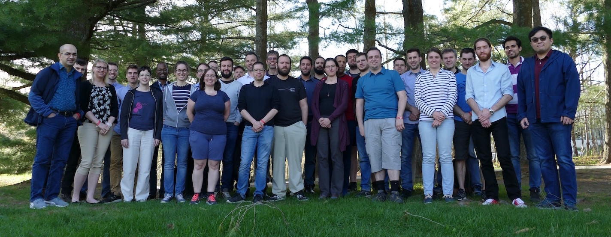


<section class="special box">
    

        <h1>Du {{ site.data.dates.ecole_date_btw_str }} à Orford Musique</h1>
        <ul class="actions stacked">
            <li><a href="{{site.data.inscription.url}}" class="button primary">Inscrivez-vous</a></li>
        </ul>
    

</section>


 

<section id="simply">
    

        
        

            Avoir des connaissances en calcul informatique de pointe (CIP) est devenu un outil incontournable pour l’ensemble de la communauté de recherche. Cette école vous permettra d’acquérir des connaissances théoriques et pratiques qui pourront être appliquées directement à vos travaux de recherche et qui vous permettront de vous démarquer. Cette école représente également une occasion unique d’avoir un accès privilégié aux analystes de Calcul Québec qui seront sur place pour la durée de l’événement.
        

    

</section>

<section id="temoignages">
    <blockquote>
        {{ site.data.temoignages.first.quote }}
    </blockquote>
    – {{ site.data.temoignages.first.person }}
      
    <section class="special">
        <ul class="special actions">
            <li><a href="temoignages" class="button small">Lire les témoignages</a></li>
        </ul>
    </section>
</section>
